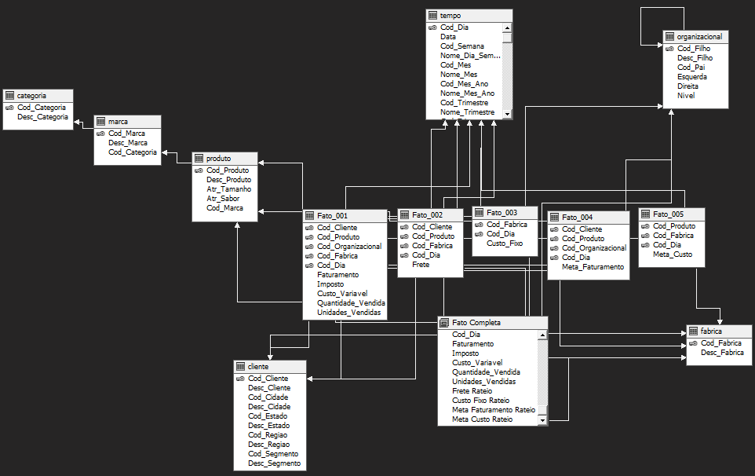

# Estrutura e Documentação - OLAP

## Descrição

Esta documentação tem como objetivo apresentar a arquitetura do solução Analysis Services Multidimensional and Data Mining Project que foi criada para atender as necessidades da empresa Sucos de Frutas.

## Etapas da solução
#### Criação de Data Source View e Adição de uma Nova Tabela
- Essa tabela foi criada com um relacionamento entre todas as tabelas de fatos e dimensões, abordando todas as métricas em uma só tabela. É chamada de **FATO COMPLETA**
 

#### Criação de quatro cubos
- VENDAS.cube (Focado em vendas e disponibilizado para os stakeholders) - Fatos 001/002/004
- CUSTOS.cube (Focado em custos e disponibilizado para os stakeholders) - Fatos 001/003/005
- PRESIDENCIA.cube (Criado para a presidência aborda todas as fatos)  - Fatos 001/002/003/004/005
- COMPLETO.cube (Aborda a fato completa) - Fato Completa

#### Criação de Hierárquias
- Fabrica.dim (Hierarquia Fabrica)
- Cliente.dim (Hierarquia Geografica / Hierarquia Segmento)
- Produto.dim (Hierarquia de Produtos)
- Organizacional.dim  
- Tempo.dim (Hierarquia do Mês / Hierarquia do Mês e Ano)

#### Deploy dos Cubos e Hierárquias no Servidor Analysis Services
- É realizado o deploy dos cubos e hierárquias criadas no servidor SSAS