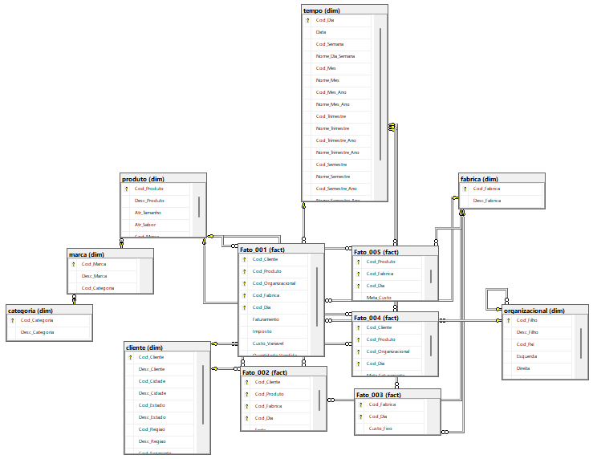

# Estrutura e Documentação - fruit_juice (Database Project)

## Descrição

Fruit Juice é um banco de dados SQL que representa as tabelas de fatos e dimensões criadas para atender o Data Warehouse da empresa Sucos de Frutas. Este projeto, contém scripts que vão definir a infraestrutura do banco de dados. Desde a definição das tabelas, campos e tipos de dados com os quais vamos trabalhar, até as regras de inserção desses dados, chaves, restrições e afins. 
	
    
Inicialmente, é preciso deixar claro como se dá os relacionamentos das tabelas presentes no banco, para facilitar o entendimento de como isso se desenvolve utilizamos o diagrama abaixo:

### **ERD**:

### **Tabelas de Dimensão**:
A seguir, estão listadas as tabelas de dimensão:

- dim.marca - Possui todas as marcas relacionadas com os produtos, faz parte de uma dimensão SnowFlake.
- dim.categoria - Possui todas as categorias relacionadas com os produtos, faz parte de uma dimensão SnowFlake.
- dim.produto - Carrega as informações do produtos que são vendidos pela empresa.
- dim.cliente - Carrega as informações dos clientes que estão relacionados com a empresa.
- dim.fabrica - Carrega as informações de todas as fábricas que estão relacionados com a produção da empresa.
- dim.tempo - É uma tabela de tempo, utilizada em Data Warehouses.
- dim.organizacional - Carrega as informações de gerência, faz parte de uma dimensão Pai-Filho.

### **Tabelas de Fatos**:
A seguir, estão listadas as tabelas de Fatos:

- fact.Fato001 - Carrega as informações de faturamento, imposto, custo e unidades vendidas pela empresa.
- fact.Fato002 - Carrega as informações de custo de frete.
- fact.Fato003 - Carrega as informações de metas de faturamento.
- fact.Fato005 - Carrega as informações de metas de custos.

## **Schemas**

| **Name** | **Comment** |
| ---- | ------- |
| dim | Criado para Tabelas de Dimensão |
| fact | Criado para Tabelas de Fato |
| staging | Criado para Tabelas Auxiliares |

## Stored Procedures and Functions

- dbo.SPMONTAESQDIR.sql - Procedure utilizada na criação e carregamento da tabela de dimensão Pai-Filho.

---
---
---
---
---

# Structure and Documentation - fruit_juice (Database Project)

## Description
Fruit Juice is a SQL database representing the fact and dimension tables created to serve the Data Warehouse of the Sucos de Frutas company. This project contains scripts that define the database infrastructure, from defining tables, fields, and data types to data insertion rules, keys, constraints, and more.

Initially, it is important to clarify the relationships between the tables in the database. To facilitate understanding of how this develops, we use the diagram below:

### **ERD**:

### **Dimension Tables**:
Below are the dimension tables:

- dim.marca - Contains all brands related to products, part of a SnowFlake dimension.
- dim.categoria - Contains all categories related to products, part of a SnowFlake dimension.
- dim.produto - Holds information about the products sold by the company.
- dim.cliente - Stores information about the customers related to the company.
- dim.fabrica - Contains information about all factories related to the company's production.
- dim.tempo - A time table used in Data Warehouses.
- dim.organizacional - Holds information about management, part of a Parent-Child dimension.

### **Fact Tables**:
Below are the fact tables:

- fact.Fato001 - Stores information about revenue, tax, cost, and units sold by the company.
- fact.Fato002 - Contains information about shipping costs.
- fact.Fato003 - Stores information about revenue goals.
- fact.Fato005 - Stores information about cost goals.

## **Schemas**

| **Name** | **Comment** |
| ---- | ------- |
| dim | Created for Dimension Tables |
| fact | Created for Fact Tables |
| staging | Created for Auxiliary Tables |

## Stored Procedures and Functions

- dbo.SPMONTAESQDIR.sql - Procedure used in the creation and loading of the Parent-Child dimension table.